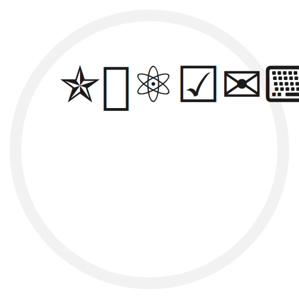
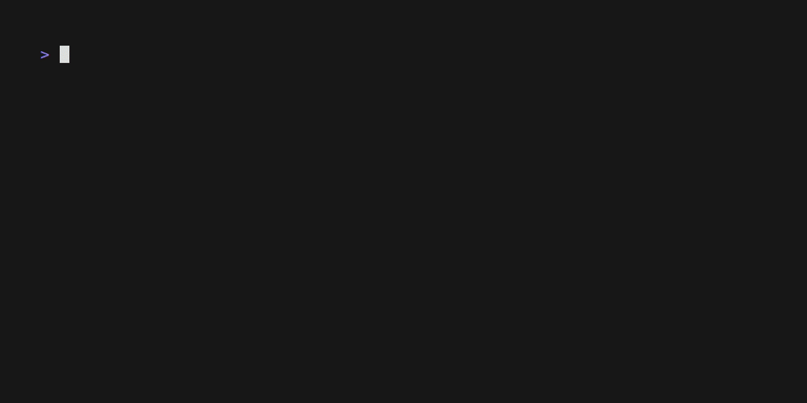

Unicodery
=========

<!-- To publish to PowerShell Gallery, commit an update to the .psd1 file -->

Cmdlets to search, lookup, and get details about Unicode characters.

- [Get-CharacterDetails](https://github.com/brianary/Unicodery/wiki/Get-CharacterDetails): Returns filterable categorical information about characters in the Unicode Basic Multilingual Plane.
- [Get-Unicode](https://github.com/brianary/Unicodery/wiki/Get-Unicode): Returns the (UTF-16) .NET string for a given Unicode codepoint, which may be a surrogate pair.
- [Get-UnicodeByName](https://github.com/brianary/Unicodery/wiki/Get-UnicodeByName): Returns characters based on Unicode code point name, GitHub short code, or HTML entity.
- [Get-UnicodeData](https://github.com/brianary/Unicodery/wiki/Get-UnicodeData): Returns the current (cached) Unicode character data.
- [Get-UnicodeName](https://github.com/brianary/Unicodery/wiki/Get-UnicodeName): Returns the name of a Unicode code point.
- [Import-CharConstants](https://github.com/brianary/Unicodery/wiki/Import-CharConstants): Imports characters by name as constants into the current scope.
